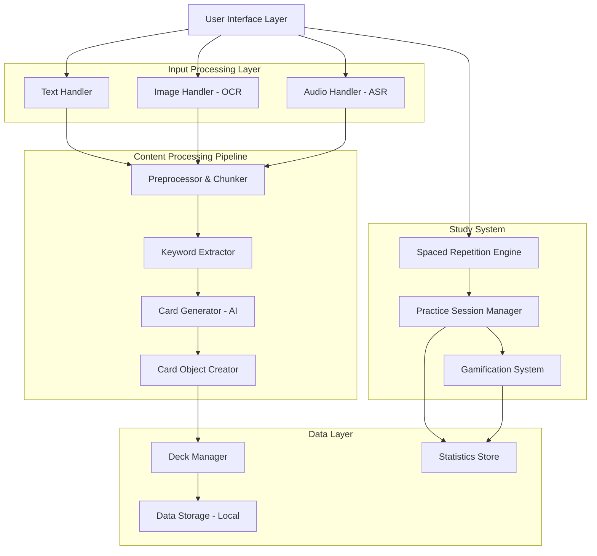

# Design Document

## Overview

Recall is architected as a local-first desktop application with a modular pipeline design. The system processes multiple input types through specialized handlers, generates flashcards using local AI models, and provides an engaging study experience with spaced repetition algorithms. All processing occurs locally to ensure privacy and offline functionality.

## Architecture

### High-Level Architecture



### Technology Stack

- **Frontend**: Electron with React/TypeScript for cross-platform desktop app
- **AI Processing**: Local LLM integration (Ollama/LM Studio) for card generation
- **OCR**: Tesseract.js for client-side image text extraction
- **Speech Recognition**: OpenAI Whisper (local deployment) for audio transcription
- **Database**: SQLite for local data persistence
- **File Processing**: PDF.js for PDF parsing, mammoth.js for DOCX

## Components and Interfaces

### Input Processing Components

#### TextHandler
```typescript
interface TextHandler {
  supportedFormats: string[];
  extractText(file: File): Promise<ExtractedContent>;
  validateContent(content: string): ValidationResult;
}

interface ExtractedContent {
  text: string;
  metadata: {
    source: string;
    format: string;
    extractedAt: Date;
    confidence?: number;
  };
}
```

#### ImageHandler (OCR)
```typescript
interface ImageHandler {
  processImage(file: File): Promise<OCRResult>;
  validateImageQuality(file: File): QualityAssessment;
}

interface OCRResult {
  text: string;
  confidence: number;
  boundingBoxes: TextRegion[];
  requiresReview: boolean;
}
```

#### AudioHandler (ASR)
```typescript
interface AudioHandler {
  transcribeAudio(file: File): Promise<TranscriptionResult>;
  getProgress(): TranscriptionProgress;
}

interface TranscriptionResult {
  transcript: string;
  confidence: number;
  segments: AudioSegment[];
  duration: number;
}
```

### Content Processing Pipeline

#### ContentPreprocessor
```typescript
interface ContentPreprocessor {
  chunkContent(content: ExtractedContent): ContentChunk[];
  cleanText(text: string): string;
  detectLanguage(text: string): string;
}

interface ContentChunk {
  id: string;
  text: string;
  position: number;
  context: string;
  importance: number;
}
```

#### KeywordExtractor
```typescript
interface KeywordExtractor {
  extractKeywords(chunks: ContentChunk[]): Keyword[];
  rankByImportance(keywords: Keyword[]): Keyword[];
}

interface Keyword {
  term: string;
  importance: number;
  context: string[];
  category: KeywordCategory;
}
```

#### CardGenerator
```typescript
interface CardGenerator {
  generateCards(keywords: Keyword[], context: ContentChunk[]): Promise<FlashCard[]>;
  validateCardQuality(card: FlashCard): QualityScore;
}

interface FlashCard {
  id: string;
  front: string;
  back: string;
  type: CardType;
  difficulty: DifficultyLevel;
  keywords: string[];
  sourceContext: string;
  createdAt: Date;
}
```

### Study System Components

#### SpacedRepetitionEngine
```typescript
interface SpacedRepetitionEngine {
  calculateNextReview(card: FlashCard, response: StudyResponse): Date;
  selectCardsForSession(deck: Deck, sessionLength: number): FlashCard[];
  updateCardStatistics(card: FlashCard, response: StudyResponse): void;
}

interface StudyResponse {
  cardId: string;
  correct: boolean;
  responseTime: number;
  difficulty: UserDifficulty;
  timestamp: Date;
}
```

#### GamificationSystem
```typescript
interface GamificationSystem {
  updateStreak(userId: string, sessionCompleted: boolean): StreakInfo;
  generateChallenge(userLevel: number): Challenge;
  calculatePoints(session: StudySession): number;
  checkAchievements(userStats: UserStatistics): Achievement[];
}

interface StreakInfo {
  currentStreak: number;
  longestStreak: number;
  lastStudyDate: Date;
  streakActive: boolean;
}
```

### Data Management

#### DeckManager
```typescript
interface DeckManager {
  createDeck(name: string, description?: string): Deck;
  addCardToDeck(deckId: string, card: FlashCard): void;
  moveCard(cardId: string, fromDeck: string, toDeck: string): void;
  getDeckStatistics(deckId: string): DeckStats;
}

interface Deck {
  id: string;
  name: string;
  description: string;
  cards: FlashCard[];
  createdAt: Date;
  lastStudied: Date;
  settings: DeckSettings;
}
```

## Data Models

### Core Entities

```typescript
// User Progress Tracking
interface UserStatistics {
  totalCardsStudied: number;
  correctAnswers: number;
  currentStreak: number;
  totalStudyTime: number;
  level: number;
  achievements: Achievement[];
}

// Study Session
interface StudySession {
  id: string;
  deckId: string;
  startTime: Date;
  endTime?: Date;
  cardsReviewed: StudyResponse[];
  sessionType: SessionType;
  pointsEarned: number;
}

// Spaced Repetition Data
interface CardStatistics {
  cardId: string;
  easeFactor: number;
  interval: number;
  repetitions: number;
  nextReview: Date;
  lastReviewed: Date;
  averageResponseTime: number;
  successRate: number;
}
```

### Database Schema

```sql
-- Core Tables
CREATE TABLE decks (
  id TEXT PRIMARY KEY,
  name TEXT NOT NULL,
  description TEXT,
  created_at DATETIME DEFAULT CURRENT_TIMESTAMP,
  last_studied DATETIME,
  settings JSON
);

CREATE TABLE cards (
  id TEXT PRIMARY KEY,
  deck_id TEXT REFERENCES decks(id),
  front TEXT NOT NULL,
  back TEXT NOT NULL,
  type TEXT NOT NULL,
  difficulty INTEGER,
  keywords JSON,
  source_context TEXT,
  created_at DATETIME DEFAULT CURRENT_TIMESTAMP
);

CREATE TABLE card_statistics (
  card_id TEXT PRIMARY KEY REFERENCES cards(id),
  ease_factor REAL DEFAULT 2.5,
  interval INTEGER DEFAULT 1,
  repetitions INTEGER DEFAULT 0,
  next_review DATETIME,
  last_reviewed DATETIME,
  average_response_time REAL,
  success_rate REAL
);

CREATE TABLE study_sessions (
  id TEXT PRIMARY KEY,
  deck_id TEXT REFERENCES decks(id),
  start_time DATETIME NOT NULL,
  end_time DATETIME,
  session_type TEXT,
  points_earned INTEGER DEFAULT 0
);

CREATE TABLE study_responses (
  id TEXT PRIMARY KEY,
  session_id TEXT REFERENCES study_sessions(id),
  card_id TEXT REFERENCES cards(id),
  correct BOOLEAN NOT NULL,
  response_time INTEGER,
  difficulty INTEGER,
  timestamp DATETIME DEFAULT CURRENT_TIMESTAMP
);
```

## Error Handling

### Error Categories and Strategies

#### Input Processing Errors
- **File Format Errors**: Graceful fallback to manual input with clear error messages
- **OCR Failures**: Confidence threshold checking with manual review prompts
- **Audio Transcription Errors**: Progress indicators and retry mechanisms
- **Large File Handling**: Chunked processing with progress feedback

#### AI Processing Errors
- **Model Unavailability**: Fallback to simpler rule-based generation
- **Generation Quality Issues**: Quality validation with user review options
- **Performance Issues**: Timeout handling and background processing

#### Data Persistence Errors
- **Storage Failures**: Automatic backup creation and recovery procedures
- **Corruption Detection**: Data integrity checks and repair mechanisms
- **Migration Errors**: Version compatibility and rollback procedures

### Error Recovery Mechanisms

```typescript
interface ErrorHandler {
  handleInputError(error: InputError): RecoveryAction;
  handleProcessingError(error: ProcessingError): RecoveryAction;
  handleStorageError(error: StorageError): RecoveryAction;
}

interface RecoveryAction {
  type: 'retry' | 'fallback' | 'manual' | 'skip';
  message: string;
  options?: RecoveryOption[];
}
```

## Testing Strategy

### Unit Testing
- **Component Testing**: Individual handlers and processors
- **Algorithm Testing**: Spaced repetition calculations and keyword extraction
- **Data Layer Testing**: CRUD operations and data integrity

### Integration Testing
- **Pipeline Testing**: End-to-end content processing workflows
- **Study Flow Testing**: Complete study session scenarios
- **Cross-Component Testing**: Data flow between major system components

### Performance Testing
- **Large File Processing**: Memory usage and processing time benchmarks
- **Concurrent Operations**: Multiple file processing and study sessions
- **Database Performance**: Query optimization and bulk operations

### User Experience Testing
- **Accessibility Testing**: Screen reader compatibility and keyboard navigation
- **Offline Functionality**: Complete feature availability without internet
- **Cross-Platform Testing**: Windows, macOS, and Linux compatibility

### Test Data Management
- **Sample Content**: Curated test documents, images, and audio files
- **Mock AI Responses**: Predictable outputs for consistent testing
- **Performance Benchmarks**: Baseline metrics for regression testing